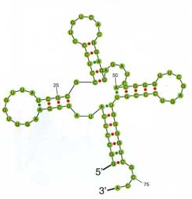

1. [Installation](#installation)
1. [Overview](#overview)
1. [Examples](#examples)
1. [References](#references)
1. [Roadmap](#roadmap)

<a name="installation"></a>
## Installation

```bash
pip install crossy
```

<a name="overview"></a>
## Overview

The goal of `crossy` is to provide RNA stability tools for researchers and scientists in a well-tested Python package which is easy to install and use.

The name `crossy` is a reference to RNA secondary structure which sometimes forms a "cross" shape.



<a name="examples">
## Examples

Create mRNA object and calculate stability.

```python
from crossy import MRNA
from crossy.analyze import monte_carlo_strategy, apply_substitutions

# Generate MRNA object
mrna = MRNA.from_sequence("CCTACAGCAACTTTAGATGTTACTGAAGTC")
stability = mrna.total_stability  # 0.466...
```

Get and apply substitutions to target a 0.5 increase in stability.

```python
# Get and apply substitutions
substitutions = monte_carlo_strategy(mrna.get_candidate_substitutions(), 0.5)
new_mrna = apply_substitutions(mrna, substitutions)

new_mrna.total_stability  # 0.964 ~ 0.466 + 0.5
```

<a name="references">
## References

The mRNA stability calculation is primarily based on work in <i>Saccharomyces cerevisiae</i> from Coller lab from 2015: [<i>Codon Optimality Is a Major Determinant of mRNA Stability</i>](https://www.sciencedirect.com/science/article/pii/S0092867415001956)

The work showed a quantitative relationship between codon prevalance and mRNA half life in living cells.

<a name="roadmap">
## Roadmap

+ Recent reviews discuss the relationship between codon prevalence and mRNA stability, translation rate, and correct folding: [link](https://e-tarjome.com/storage/btn_uploaded/2019-07-10/1562737049_9682-etarjome-English.pdf).
    + The relationship between these effects and tRNA prevalance (tRNA Adaptive Index, TAI), which is known for several species, is discussed.

+ Predictive RNA secondary structure models are now (being developed)[http://rna.tbi.univie.ac.at/cgi-bin/RNAWebSuite/RNAfold.cgi].

+ RNA stability in storage is the subject of a recent (Kaggle competition)[https://www.kaggle.com/c/stanford-covid-vaccine/data].